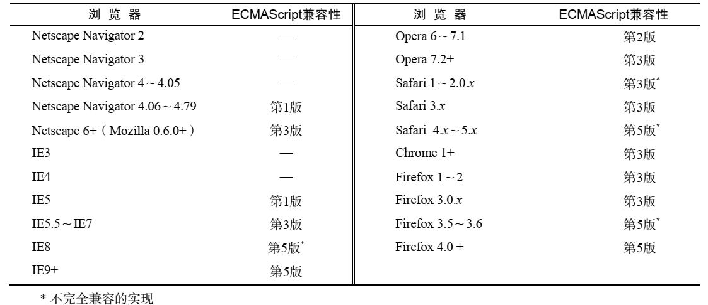
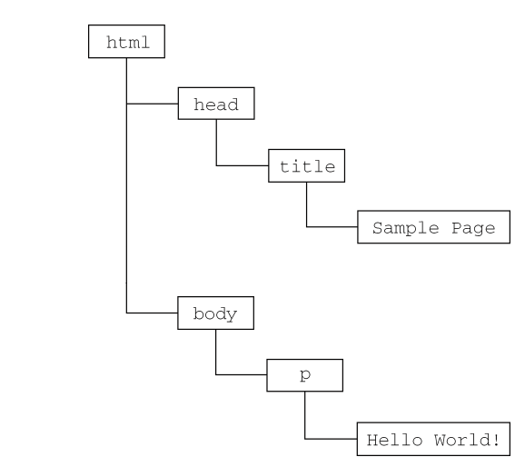

## 第一章  JavaScript简介

### 1.1  JavaScript实现

一个完整的 JavaScript 实现应该由下列三个不同的部分组成 :

- 核心（ECMAScript）:由 ECMA-262 定义，提供核心语言功能； 

- 文档对象模型（DOM）:提供访问和操作网页内容的方法和接口； 

- 浏览器对象模型（BOM）:提供与浏览器交互的方法和接口 

  <!--more-->

#### 1.1.1 ECMAScript

ECMAScript都规定了些什么内容呢？大致说来，它规定了这门语言的下列组成部分：

* 语法
* 类型
* 语句
* 关键字
* 保留字
* 操作符
* 对象

下表列出了 ECMAScript 受主流 Web 浏览器支持的情况 ：

#### 1.1.2 文档对象模型（DOM）

1.文档对象模型（ DOM， Document Object Model）是针对 XML 但经过扩展用于 HTML 的应用程序编程接口（ API， Application Programming Interface）。 DOM 把整个页面映射为一个多层节点结构。 HTML或 XML 页面中的每个组成部分都是某种类型的节点，这些节点又包含着不同类型的数据。 

下面这个HTML页面：

~~~html
<html>
  <head>
    <title>Sample Page</title>
  </head>
  <body>
    
Hello World!

  </body>
</html>
~~~

在 DOM 中，这个页面可以通过下图的分层节点图表示：

通过 DOM 创建的这个表示文档的树形图，开发人员获得了控制页面内容和结构的主动权。借助DOM 提供的 API，开发人员可以轻松自如地删除、添加、替换或修改任何节点 。

2.DOM级别

* DOM1：DOM1 级的目标主要是映射文档的结构， 
  * DOM核心(DOM Core )：DOM 核心规定的是如何映射基于 XML 的文档结构，以便简化对文档中任意部分的访问和操作。 
  * DOM HTML：DOM HTML 模块则在 DOM 核心的基础上加以扩展，添加了针对 HTML 的对象和方法 。

* DOM2：DOM2 级在原来 DOM 的基础上又扩充了（ DHTML 一直都支持的）鼠标和用户界面事件、范围、遍历（迭代 DOM文档的方法）等细分模块，而且通过对象接口增加了对 CSS（ Cascading Style Sheets，层叠样式表）的支持。 
  * DOM 视图（ DOM Views）：定义了跟踪不同文档（例如，应用 CSS 之前和之后的文档）视图的接口； 
  * DOM 事件（ DOM Events）：定义了事件和事件处理的接口； 
  * DOM 样式（ DOM Style）：定义了基于 CSS 为元素应用样式的接口； 
  * DOM 遍历和范围（ DOM Traversal and Range）：定义了遍历和操作文档树的接口。 

* DOM3：DOM3 级则进一步扩展了 DOM，引入了以统一方式加载和保存文档的方法——在 DOM 加载和保
  存（ DOM Load and Save）模块中定义；新增了验证文档的方法——在 DOM 验证（ DOM Validation）模 块中定义。 

#### 1.1.3 浏览器对象模型(BOM)

从根本上讲， BOM 只处理浏览器窗口和框架；但人们习惯上也把所有针对浏览器的 JavaScript 扩展算作 BOM 的一部分。下面就是一些这样的扩展： 

* 弹出新浏览器窗口的功能；
* 移动、缩放和关闭浏览器窗口的功能；
* 提供浏览器详细信息的 navigator 对象;
* 提供浏览器所加载页面的详细信息的 location 对象;
* 提供用户显示器分辨率详细信息的 screen 对象；
* 对 cookies 的支持；
* 像 XMLHttpRequest 和 IE 的 ActiveXObject 这样的自定义对象。 