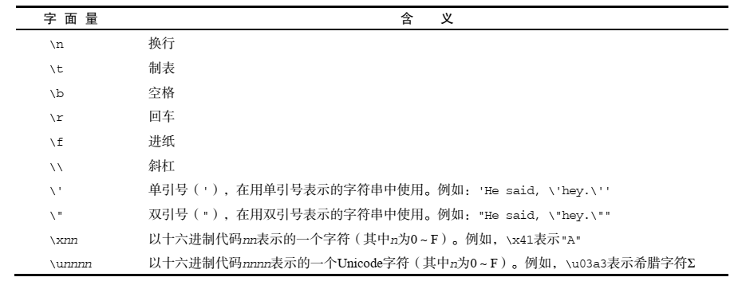

## 第三章 基本概念

本章内容

* 语法

* 数据类型

* 流控制语句

* 函数 

  <!--more-->

### 3.1 语法

#### 3.1.1 区分大小写

ECMAScript 中的一切（变量、函数名和操作符）都区分大小写 

#### 3.1.2 标识符

所谓标识符，就是指变量、函数、属性的名字，或者函数的参数。标识符可以是按照下列格式规则
组合起来的一或多个字符： 

* 第一个字符必须是一个字母、下划线（ _）或一个美元符号（ $）； 
* 其他字符可以是字母、下划线、美元符号或数字。 

ECMAScript 标识符采用驼峰大小写格式 ，例如：firstSecond ；

不能把关键字、保留字、 true、 false 和 null 用作标识符。 

#### 3.1.3 严格模式

ECMAScript 5 引入了严格模式（ strict mode）的概念。 要在整个脚本中启用严格模式，可以在顶部添加如下代码： 

~~~javascript
"use strict";
~~~

其实它是一个编译指示（ pragma） 

在函数内部的上方包含这条编译指示，也可以指定函数在严格模式下执行： 

~~~javascript
function doSomething(){
  "use strict";
  //函数体
}
~~~

### 3.2 关键字和保留字

以下就是 ECMAScript的全部关键字（带*号上标的是第 5 版新增的关键字）： 

`break`				  `do`		          `instanceof`		 `typeof`
`case`	 			   `else`	 	       `new` 		           `var`
`catch`			      `finally` 		   `return`		         `void`
`continue` 		    `for`		         `switch`		       ` while`
`debugger*`         `function`       ` this `		            `with`
`default`		       ` if` 		          ` throw`
`delete` 		        `in` 		           `try` 

以下是 ECMA-262 第 3 版定义的全部保留字：
`abstract`			 `enum`			 `int`					`short`
`boolean`			` export` 		  ` interface` 		`static`
`byte` 				   `extends` 		`long` 				` super`
`char` 				   `final` 			  `native` 			  `synchronized`
`class` 				 ` float` 			  `package` 		 ` throws`
`const`				  `goto` 			  `private` 			`transient`
`debugger`		  `implements`  `protected`		 `volatile`
`double`			   `import` 		  `public `

### 3.3 数据类型

#### 3.3.1  `typeof`操作符

检测给定变量的数据类型—— `typeof` ，对一个值使用` typeof` 操作符可能返回下列某个字符串： 

* "`undefined`"——如果这个值未定义；
* "`boolean`"——如果这个值是布尔值；
* "`string`"——如果这个值是字符串； 
*  "`number`"——如果这个值是数值；
* "`object`"——如果这个值是对象或 null；
* "`function`"——如果这个值是函数。 

#### 3.3.2  `Undefined`类型

Undefined 类型只有一个值，即特殊的 undefined。在使用 `var` 声明变量但未对其加以初始化时，这个变量的值就是 undefined ；

~~~javascript
var message;
alert(message == undefined); //true
~~~

#### 3.3.3 `Null`类型

Null 类型是第二个只有一个值的数据类型，这个特殊的值是 null。 null 值表示一个**空对象指针**，而这也正是使用` typeof` 操作符检测 null 值时会返回"object"的原因，如下面的例子所示： 

~~~javascript
var car = null;
alert(typeof car); // "object"
~~~

实际上， undefined 值是派生自 null 值的，因此 ECMA-262 规定对它们的相等性测试要返回 true： 

~~~javascript
alert(null == undefined); //true
~~~

#### 3.3.4  `Boolean`类型

该类型只有两个字面值： true 和 false。 true 不一定等于 1，而 false 也不一定等于 0。 

可以对任何数据类型的值调用 Boolean()函数，而且总会返回一个 Boolean 值。 

~~~javascript
var message = "Hello world!";
var messageAsBoolean = Boolean(message);
~~~

在这个例子中，字符串 message 被转换成了一个 `Boolean `值， 该值被保存在 `messageAsBoolean`
变量中。 

下表给出了各种数据类型及其对应的转换规则。 

| 数据类型  | 转换为true值   | 转换为false值 |
| --------- | -------------- | ------------- |
| Boolean   | true           | false         |
| String    | 任何非空字符串 | ""(空字符串)  |
| Number    | 任何非0数字    | 0和`NaN`      |
| Object    | 任何对象       | null          |
| Undefined |                | undefined     |

#### 3.3.5 `Number`类型

最基本的数值字面量格式是十进制整数 ，除了以十进制表示外，整数还可以通过八进制（以 8 为基数）或十六进制（以 16 为基数）的字面值来表示。

 八进制字面值的第一位必须是零（ 0），然后是八进制数字序列(0-7)。如果字面值中的数值超出了范围，那么前导零将被忽略，后面的数值将被当作十进制数值解析。 八进制字面量在严格模式下是无效的 ;

十六进制字面值的前两位必须是 0x，后跟任何十六进制数字（ 0-9 及 A-F）。其中，字母 A-F可以大写，也可以小写。

##### 浮点数值

 对于那些极大或极小的数值，可以用 e 表示法（即科学计数法）表示的浮点数值表示。 用 e 表示法表示的数值等于 e 前面的数值乘以 10 的指数次幂。 

~~~javascript
var floatNum = 3.125e7; // 等于 31250000
~~~

##### 数值范围

ECMAScript 中

能够表示的最小数值保存在 `Number.MIN_VALUE` 中——在大多数浏览器中，这个值是 5e-324；

能够表示的最大数值保存在`Number.MAX_VALUE` 中——在大多数浏览器中，这个1.7976931348623157e+308。 

如果某次计算的结果得到了一个超出 JavaScript 数值范围的值， 如果这个数值是负数，则会被转换成-Infinity（负无穷），如果这个数值是正数，则会被转换成 Infinity（正无穷）。 

要想确定一个数值是不是有穷的可以使用` isFinite()`函数 ；

~~~javascript
var result = Number.MAX_VALUE + Number.MAX_VALUE;
alert(isFinite(result)); //false
~~~

##### `NaN`

`NaN`，即非数值（ Not a Number）是一个特殊的数值 ，这个数值用于表示一个本来要返回数值的操作数未返回数值的情况（这样就不会抛出错误了）。 

例如，在其他编程语言中，任何数值除以 0 都会导致错误，从而停止代码执行。但在 ECMAScript 中，任何数值除以 0 会返回 `NaN`，因此不会影响其他代码的执行。 

`NaN` 本身有两个非同寻常的特点：

首先，任何涉及 `NaN` 的操作（例如 `NaN`/10）都会返回 `NaN`，这个特点在多步计算中有可能导致问题。

其次， `NaN` 与任何值都不相等，包括` NaN` 本身。

ECMAScript 定义了 `isNaN()`函数 ，这个函数接受一个参数，该参数可以是任何类型，而函数会帮我们确定这个参数是否“不是数值” ；`isNaN()`在接收到一个值之后，会尝试将这个值转换为数值。某些不是数值的值会直接转换为数值，例如字符串"10"或 Boolean 值。而任何不能被转换为数值的值都会导致这个函数返回 true。

请看下面的例子： 

~~~javascript
alert(isNaN(NaN)); //true
alert(isNaN(10)); //false（ 10 是一个数值）
alert(isNaN("10")); //false（可以被转换成数值 10）
alert(isNaN("blue")); //true（不能转换成数值）
alert(isNaN(true)); //false（可以被转换成数值 1）
~~~

##### 数值转换

有 3 个函数可以把非数值转换为数值：` Number()`、 `parseInt()`和 `parseFloat() `

转型函数 Number()可以用于任何数据类型 ；另两个函数则专门用于把字符串转换成数值 

Number()函数的转换规则如下 ：

* 如果是 Boolean 值， true 和 false 将分别被转换为 1 和 0 
* 如果是数字值，只是简单的传入和返回 
* 如果是 null 值，返回 0
* 如果是 undefined，返回 `NaN` 
* 如果是字符串，遵循下列规则： 
  * 如果字符串中只包含数字（包括前面带正号或负号的情况），则将其转换为十进制数值，即"1"会变成 1， "123"会变成 123，而"011"会变成 11（注意：前导的零被忽略了）； 
  * 如果字符串中包含有效的浮点格式，如"1.1"，则将其转换为对应的浮点数值（同样，也会忽略前导零）； 
  * 如果字符串中包含有效的十六进制格式，例如"0xf"，则将其转换为相同大小的十进制整数值； 
  * 如果字符串是空的（不包含任何字符），则将其转换为 0； 
  * 如果字符串中包含除上述格式之外的字符，则将其转换为 `NaN`。 
* 如果是对象，则调用对象的 `valueOf()`方法，然后依照前面的规则转换返回的值。如果转换的结果是 `NaN`，则调用对象的 `toString()`方法，然后再次依照前面的规则转换返回的字符串值。 

`parseInt()`函数在转换字符串时，更多的是看其是否符合数值模式。它会忽略字符串前面的空格，直至找到第一个非空格字符。如果第一个字符不是数字字符或者负号，` parseInt()`就会返回 `NaN`；也就是说，用 `parseInt()`转换空字符串会返回` NaN（ `Number()`对空字符返回 0）。如果第一个字符是数字字符，` `parseInt()`会继续解析第二个字符，直到解析完所有后续字符或者遇到了一个非数字字符。

~~~javascript
var num1 = parseInt("1234blue"); // 1234
var num2 = parseInt(""); // NaN
var num3 = parseInt("0xA"); // 10（十六进制数）
var num4 = parseInt(22.5); // 22
var num5 = parseInt("070"); // 56（八进制数）
var num6 = parseInt("70"); // 70（十进制数）
var num7 = parseInt("0xf"); // 15（十六进制数）
~~~

`parseFloat()`也是从第一个字符（位置 0）开始解析每个字符。而且也是一直解析到字符串末尾，或者解析到遇见一个无效的浮点数字字符为止。也就是说，字符串中的第一个小数点是有效的，而第二个小数点就是无效的了，因此它后面的字符串将被忽略。举例来说，"22.34.5"将会被转换为 22.34。 

`parseFloat()`将 十六进制格式的字符串转换成 0 ；

最后还要注意一点：如果字符串包含的是一个可解析为整数的数(没有小数点，或者小数点后都是零)`parseFloat()`会返回整数。 

#### 3.3.6 `String`类型

String 类型用于表示由零或多个 16 位 Unicode 字符组成的字符序列，即字符串。 

##### 字符字面量

String 数据类型包含一些特殊的字符字面量，也叫**转义序列**，用于表示非打印字符，或者具有其他用途的字符。这些字符字面量如下表所示： 

##### 字符串的特点 

ECMAScript 中的字符串是不可变的 

##### 转换为字符串

要把一个值转换为一个字符串有两种方式。第一种是使用几乎每个值都有的 `toString()`方法 ，这个方法唯一要做的就是返回相应值的字符串表现。 null 和 undefined 值没有这个方法 。

调用` toString()`方法不必传递参数。

但是，在调用数值的` toString()`方法时，可以传递一个参数：输出数值的基数(进制数)。 

在不知道要转换的值是不是 null 或 undefined 的情况下，还可以使用转型函数 `String()`，这个函数能够将任何类型的值转换为字符串。` String()`函数遵循下列转换规则：

* 如果值有` toString()`方法，则调用该方法（没有参数）并返回相应的结果；
* 如果值是 null，则返回"null"；
* 如果值是 undefined，则返回"undefined"。 

#### 3.3.7 `Object`类型

ECMAScript 中的对象其实就是一组数据和功能的集合。 对象可以通过执行 new 操作符后跟要创建的对象类型的名称来创建。 而创建 Object 类型的实例并为其添加属性和（或）方法，就可以创建自定义对象：

~~~javascript
var o = new Object();
~~~

Object 的每个实例都具有下列属性和方法:

* `constructor`：保存着用于创建当前对象的函数。对于前面的例子而言，构造函数（ constructor）就是 Object() 
* `hasOwnProperty(propertyName)`：用于检查给定的属性在当前对象实例中（而不是在实例的原型中）是否存在。其中，作为参数的属性名必须以字符串形式指定（例如： `o.hasOwnProperty("name")`） 
* `isPrototypeOf(object)`：用于检查传入的对象是否是传入对象的原型
* `propertyIsEnumerable(propertyName)`：用于检查给定的属性是否能够使用 for-in 语句来枚举。与` hasOwnProperty()`方法一样，作为参数的属性名必须以字符串形式指定。 
* `toLocaleString()`：返回对象的字符串表示，该字符串与执行环境的地区对应。 
* `toString()`：返回对象的字符串表示。 
* `valueOf()`：返回对象的字符串、数值或布尔值表示。通常与 `toString()`方法的返回值相同。 

由于在 ECMAScript 中 `Object` 是所有对象的基础，因此所有对象都具有这些基本的属性和方法。 

### 3.4 操作符

#### 3.4.1 一元操作符

前置递增/减操作符（++a/--a）

~~~javascript
var age = 29;
++age;
~~~

相当于

~~~javascript
var age = 29;
age = age + 1;
~~~

后置递增/减操作符（a++/a--）

~~~javascript
var age = 29;
age++;
~~~

把递增操作符放在变量后面并不会改变语句的结果 

~~~javascript
var num1 = 2;
var num2 = 20;
var num3 = num1-- + num2; // 等于 22
var num4 = num1 + num2; // 等于 21
~~~

#### 3.4.2 位操作符

**按位非（ NOT）** 

按位非操作符由一个波浪线（ ~）表示，执行按位非的结果就是返回数值的反码。 

~~~javascript
var num1 = 25; // 二进制 00000000000000000000000000011001
var num2 = ~num1; // 二进制 11111111111111111111111111100110
alert(num2); // -26
~~~

**按位与（ AND）** 

按位与操作符由一个和号字符（ &）表示，它有两个操作符数.

**按位或（ OR）** 

按位或操作符由一个竖线符号（ |）表示，同样也有两个操作数 .

**按位异或（ XOR）** 

按位异或操作符由一个插入符号（ ^）表示，也有两个操作数。 

这个操作在两个数值对应位上只有一个 1 时才返回 1，如果对应的两位都是 1 或都是 0，则返回 0。 

**左移**

左移操作符由两个小于号（ <<）表示，这个操作符会将数值的所有位向左移动指定的位数。 

~~~javascript
var oldValue = 2; // 等于二进制的 10
var newValue = oldValue << 5; // 等于二进制的 1000000，十进制的 64
~~~

**有符号的右移** 

有符号的右移操作符由两个大于号（ >>）表示，这个操作符会将数值向右移动，但保留符号位（即正负号标记）。 

~~~javascript
var oldValue = 64; // 等于二进制的 1000000
var newValue = oldValue >> 5; // 等于二进制的 10 ，即十进制的 2
~~~

**无符号右移** 

无符号右移操作符由 3 个大于号（ >>>）表示，这个操作符会将数值的所有 32 位都向右移动。 对正数来说，无符号右移的结果与有符号右移相同。 

~~~javascript
var oldValue = -64; // 等于二进制的 11111111111111111111111111000000
var newValue = oldValue >>> 5; // 等于十进制的 134217726
~~~

#### 3.4.3 布尔操作符

布尔操作符一共有 3 个：非（ NOT）、与（ AND）和或（ OR） ；

**逻辑非** 

逻辑非操作符由一个叹号(!)表示 ,逻辑非操作符遵循下列规则： 

* 如果操作数是一个对象，返回 false；
* 如果操作数是一个空字符串，返回 true；
* 如果操作数是一个非空字符串，返回 false；
*  如果操作数是数值 0，返回 true；
* 如果操作数是任意非 0 数值（包括 Infinity），返回 false；
*  如果操作数是 null，返回 true；
* 如果操作数是 `NaN`，返回 true；
* 如果操作数是 undefined，返回 true。 

**逻辑与**

逻辑与操作符由两个和号（ &&）表示，有两个操作数 ,它遵循下列规则： 

* 如果第一个操作数是对象，则返回第二个操作数；
* 如果第二个操作数是对象，则只有在第一个操作数的求值结果为 true 的情况下才会返回该
  对象；
*  如果两个操作数都是对象，则返回第二个操作数；
* 如果有一个操作数是 null，则返回 null；
* 如果有一个操作数是` NaN`，则返回 `NaN`；
* 如果有一个操作数是 undefined，则返回 undefined。 

逻辑或

逻辑或操作符由两个竖线符号（ ||）表示，有两个操作数 ,它遵循下列规则：

* 如果第一个操作数是对象，则返回第一个操作数；
* 如果第一个操作数的求值结果为 false，则返回第二个操作数；
*  如果两个操作数都是对象，则返回第一个操作数；
* 如果两个操作数都是 null，则返回 null；
* 如果两个操作数都是 `NaN`，则返回 `NaN`；
* 如果两个操作数都是 undefined，则返回 undefined。 

### 3.5 语句

#### `if`语句

~~~javascript
if (i > 25) {
   alert("Greater than 25.");
} else if (i < 0) {
   alert("Less than 0.");
} else {
   alert("Between 0 and 25, inclusive.");
}
~~~

#### `do-while`语句 

`do-while` 语句是一种后测试循环语句，即只有在循环体中的代码执行之后，才会测试出口条件。 

~~~javascript
do {
   statement
} while (expression);
~~~

#### `while`语句 

`while` 语句属于前测试循环语句， 也就是说， 在循环体内的代码被执行之前，就会对出口条件求值。 

~~~javascript
while(expression) {
   statement
}
~~~

#### `for`语句 

`for` 语句也是一种前测试循环语句，但它具有在执行循环之前初始化变量和定义循环后要执行的代码的能力。 

~~~javascript
for (initialization; expression; post-loop-expression) {
    statement
}
~~~

#### `for-in`语句 

`for-in `语句是一种精准的迭代语句，可以用来枚举对象的属性。 

~~~javascript
for (property in expression) statement

for (var propName in window) {
document.write(propName);
}
~~~

在这个例子中，我们使用` for-in` 循环来显示了 BOM 中 `window` 对象的所有属性。 

#### `label`语句 

使用 label 语句可以在代码中添加标签，以便将来使用。 

~~~javascript
label: statement

start: for (var i=0; i < count; i++) {
alert(i);
}
~~~

#### `break`和`continue`语句 

`break` 语句会立即退出循环，强制继续执行循环后面的语句。而 `continue` 语句虽然也是立即退出循环，但退出循环后会从循环的顶部继续执行。 

`break `和 `continue` 语句都可以与 label 语句联合使用，从而返回代码中特定的位置。这种联合使用的情况多发生在循环嵌套的情况下，如下面的例子所示： 

~~~javascript
var num = 0;
outermost:
for (var i=0; i < 10; i++) {
  for (var j=0; j < 10; j++) {
    if (i == 5 && j == 5) {
       break outermost;
    }
    num++;
  }
}
alert(num); //55
~~~

在这个例子中， outermost 标签表示外部的 for 语句。如果每个循环正常执行 10 次，则 `num++`语句就会正常执行 100 次。换句话说，如果两个循环都自然结束， `num` 的值应该是 100。但内部循环中的 break 语句带了一个参数：要返回到的标签。添加这个标签的结果将导致 break 语句不仅会退出内部的 for 语句（即使用变量 j 的循环），而且也会退出外部的 for 语句（即使用变量 i 的循环）。 

#### `with`语句 

`with` 语句的作用是将代码的作用域设置到一个特定的对象中。 with 语句的语法如下： 

~~~javascript
with (expression) statement;
~~~

定义 `with` 语句的目的主要是为了简化多次编写同一个对象的工作，如下面的例子所示： 

~~~javascript
var qs = location.search.substring(1);
var hostName = location.hostname;
var url = location.href;
~~~

上面几行代码都包含 `location` 对象。如果使用 `with` 语句，可以把上面的代码改写成如下所示： 

~~~javascript
with(location){
    var qs = search.substring(1);
    var hostName = hostname;
    var url = href;
}
~~~

#### `switch`语句 

~~~javascript
switch (expression) {
  case value: statement
  break;
  case value: statement
  break;
  case value: statement
  break;
  case value: statement
  break;
  default: statement
}
~~~

ECMAScript 函数不能重载。 如果在 ECMAScript 中定义了两个名字相同的函数，则该名字只属于后定义的函数。 前者会被覆盖。

